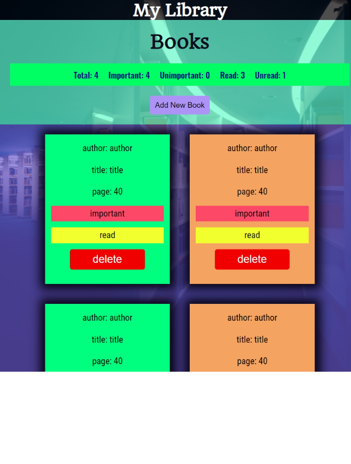

<h1 align="center">Library</h1>

  <h3>
  <!--add netlify link here-->
    <a href="https://yourlibrary.netlify.app/">
      Live Demo
    </a>
  </h3>

<!-- TABLE OF CONTENTS -->

## Table of Contents

- [Overview](#overview)
- [Built With](#built-with)
- [Features](#features)
- [Contact](#contact)

<!-- OVERVIEW -->

## Overview

### Built With

- HTML5
- CSS3
- CSS flex
- CSS transition
- JAVASCRIPT
- Implemented OOP
- Web Storage Api
- Mobile-first workflow

## Features

This application/site was created as a project from [the odin project](https://www.theodinproject.com/)
You can store your favourite book here. It is created to understand the oop in javascript. And it also uses the Web Storage Api

## Contact

- GitHub [@coder71-bd](https://github.com/coder71-bd)
